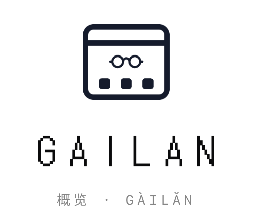

<h1 align="center">
  <picture>
    <source
      srcset="Gailan/gailan-brand-dark.png"
      media="(prefers-color-scheme: dark)"
    />
    
  </picture>
</h1>

<p align="center"><em>Keep an eye on what's happening on your machine and in the world.</em></p>

**Gailan** (概览 - Gàilǎn) is the Mandarin Chinese translation of the German *Übersicht* ("Overview").

Read it in Cantonese instead and you get 芥蘭 🥦, Chinese broccoli. That wasn't the plan, but
it's a fine vegetable and I'm not fighting it.

Gailan is a fork of [felixhageloh/uebersicht](https://github.com/felixhageloh/uebersicht). For general
info on the original project, check out the [Übersicht website](http://tracesof.net/uebersicht).

## Differences from Übersicht

Gailan is not backwards compatible with Übersicht, and it is not an in-place upgrade. The
app is a separate application with its own name, bundle id and support directory, so it
installs beside Übersicht instead of replacing it, and Übersicht's own updater will never
offer it. Widget code carries over, since the widget API is the same; settings and the
widgets folder do not, and have to be moved by hand. The bundled Node also jumped from 16
to 24, so a widget whose command depends on old Node behavior, or that bundles a native
module built for Node 16, needs rebuilding. Upstream breaking changes: Node
[18](https://github.com/nodejs/node/blob/main/doc/changelogs/CHANGELOG_V18.md),
[20](https://github.com/nodejs/node/blob/main/doc/changelogs/CHANGELOG_V20.md),
[22](https://github.com/nodejs/node/blob/main/doc/changelogs/CHANGELOG_V22.md),
[24](https://github.com/nodejs/node/blob/main/doc/changelogs/CHANGELOG_V24.md) ·
[React 19](https://react.dev/blog/2024/04/25/react-19-upgrade-guide) ·
[CoffeeScript 2](https://coffeescript.org/#breaking-changes) ·
[Emotion 11](https://emotion.sh/docs/emotion-11) ·
[ws 8](https://github.com/websockets/ws/releases/tag/8.0.0)

The specifics:

  - bundle id is `com.nich227.Gailan` (AppleScript needs the new id)
  - widgets live in `~/Library/Application Support/Gailan/widgets`
  - the widget API module is imported as `gailan`; `uebersicht` still resolves, so existing
    widgets keep working
  - the container element is `#gailan`, so user CSS targeting `#uebersicht` needs updating
  - widget commands run through **zsh** by default; Preferences has a dropdown to use
    **fish** instead. Übersicht used bash, so plain POSIX commands work the same in zsh,
    though bash-specific syntax may need adjusting
  - Preferences also has an appearance override: System, Light or Dark, which widgets
    see through `prefers-color-scheme`
  - if Übersicht is running when Gailan starts, a dialog offers to quit one of them
    (Gailan is an upgraded Übersicht, so running both doubles every widget)
  - widgets are bundled with **esbuild** rather than browserify. `.jsx`, `.tsx` and
    classic object-literal widgets all still work; what changed is that a widget bundle
    publishes itself into `globalThis.__gailanWidgets` instead of registering with
    browserify's require
  - a widget can ask macOS to glass the desktop behind it; see
    [Glass over the desktop](#glass-over-the-desktop)
  - **Widgets…** in the menu opens a window showing every installed widget as a
    card, with a switch, its screens, and the settings the widget declares. See
    [Widget settings](#widget-settings)
  - a widget can declare **its own settings**, which the app turns into controls
    and saves beside the widget
  - widget ids no longer carry the file extension: `Clock.jsx` is `Clock`, not
    `Clock-jsx`, and a widget in its own folder takes the folder's name. Anything
    referring to a widget by id, AppleScript included, needs updating
  - **Open Widgets Hub** in the menu opens the
    [widget gallery](https://gailanapp.pages.dev/hub), where each widget in
    [GailanHub](https://github.com/nich227/GailanHub) downloads as a zip. Übersicht
    widgets still work, so that gallery is worth a look too
  - **Check for Widget Updates** compares the version in each widget's `widget.json`
    against the version GailanHub holds and lists what is behind, one checkbox per
    widget, so you install the ones you want. The same check runs once a day and
    opens nothing when there is nothing to install. Your saved settings survive an
    update, since only the files the hub ships are replaced
  - **requires macOS 13.5 or later**, which the bundled Node runtime and the system APIs
    it uses both need. The app will not launch on anything older

The Node runtime is Node 24, the current LTS, and is no longer checked into git; see [Building Gailan](#building-gailan).

### Dependency versions

Against Übersicht 1.6.82, the most recent release at the time of the fork:

| | Übersicht | Gailan |
|---|---|---|
| bundled Node | 16.1.0 | 24.20.0 |
| minimum macOS | 10.11 (Podfile), 12.0 (target) | 13.5 |
| React | 16.13 | 19.2 |
| CoffeeScript | `coffee-script` 1.12, for widgets and the server | removed; the server is TypeScript |
| Emotion | 10 (`emotion`, `@emotion/core`) | 11 (`@emotion/css`, `@emotion/react`) |
| widget bundler | browserify 16.5 | esbuild 0.25 |
| browserify | 16.5 | 17.0, client and server bundles only |
| ws | 6.0 | 8.21 |
| redux | 3.7 | 5.0 |
| superagent | 3.8 | 10.3 |
| esprima / escodegen | 2.7 / 1.14 | 4.0 / 2.1 |
| minifier | uglify-js 3.10 | terser 5.51 |
| stylus | 0.54 | 0.64 |
| tape | 4.13 | 5.10 |
| through2 | 2.0 | replaced by node streams |
| jQuery | 3.5 | 3.7, deliberately not 4.x |
| Sparkle API | `SUUpdater` (Sparkle 1, deprecated) | `SPUStandardUpdaterController` |

jQuery stays on 3.x because 4.0 removes APIs that classic widgets use.
Everything else is the current release of its line.

## Migrating from Übersicht

Copy your widgets across and they will run. Gailan reads the same widget API, so the
files themselves need no changes in the common case.

    cp -R ~/Library/Application\ Support/Übersicht/widgets/* \
          ~/Library/Application\ Support/Gailan/widgets/

Übersicht's directory name contains a `ü`, which macOS may store either precomposed or
decomposed, so if the shell cannot find the path use tab completion or copy the folder in
Finder instead.

Settings do not carry over. Per-widget choices (which screen a widget shows on, whether it
is hidden, whether it sits in the background) live in the app's own preferences and have to
be set again from the status bar menu. The widgets folder location, the shell, and the
login item are in Gailan Preferences.

Both apps can run at once, but they will each render every widget, so quit Übersicht first.
Gailan offers to do that for you when it starts.

### What might need changing in a widget

  - **`import {...} from "uebersicht"`** keeps working. Gailan exposes the same module
    under both names, so there is nothing to rewrite, though `"gailan"` is the name going
    forward.
  - **CSS targeting `#uebersicht`** does not. The container element is `#gailan`. This is
    the one change most likely to be needed, and it applies to `main.css` in the widgets
    folder as well as to widget styles.
  - **AppleScript** referring to `application id "tracesOf.Uebersicht"` needs
    `"com.nich227.Gailan"`.
  - **bash-specific command syntax** may need adjusting, or set the shell back in
    Preferences. Widget commands run through zsh by default, where Übersicht used bash.
    Plain POSIX commands behave the same in both.
  - **native modules** bundled inside a widget need rebuilding against Node 24.
  - **Widget commands that depend on old Node behavior** need looking at, per the
    breaking changes linked above.

Nothing else about a widget changes: `command`, `refreshFrequency`, `render`,
`updateState`, `className`, the classic object-literal widgets, `window.$`, and the
`/run/` proxy all behave as they did.

## Writing Widgets

In essence, widgets are TypeScript (or JavaScript) modules that expose a few key properties and methods. They need to be defined in a single file with a `.tsx` (or `.jsx`) extension for Gailan to pick them up. Types are stripped when the widget is bundled, not checked. CoffeeScript widgets are not supported: Übersicht's classic API still works, but the file has to be `.js`. Check [the old documentation](ClassicWidgets.md) for that API. Gailan listens for file changes inside your widget directory, so you can edit widgets and see the result live.

Widget rendering is done using [React](https://react.dev) and its [JSX](https://react.dev/learn/writing-markup-with-jsx) syntax. Simple widget state is managed for you by Gailan, but for more advanced widgets you can manage state using a Redux-like pattern. You `dispatch` events, which are processed by a single `updateState` function that returns the new state, which is then passed to your widget's render function.

State is kept when you modify your widget, which allows for live coding. Any changes to the UI of your widget will be immediately visible. One drawback (at least with the current implementation) is that if you change the shape of your state you might have to 'Refresh all Widgets' from the app menu for your widget to work.

You can also include node modules and split your widget into separate files using [ESM syntax](http://2ality.com/2014/09/es6-modules-final.html). Any file that is in a directory called `/node_modules`, `/lib` or `/src` will be treated as a module and will not show up as a separate widget.

The following properties and methods are supported:

### command

A **string** containing the shell command to be executed, or<br>
a **function(dispatch : function)** which eventually dispatches an event,
or **undefined**, meaning that no command will be executed for this widget.

For example:

```tsx
export const command = "echo Hello World";
```

Watch out for quotes inside commands. Often they need to be properly escaped, like:

```tsx
export const command = "ps axo \"rss,pid,ucomm\" | sort -nr | head -n3";
```

Example using a command function:

```tsx
export const command = (dispatch) =>
  fetch('some/url.json')
    .then((response) => {
      dispatch({ type: 'FETCH_SUCCEEDED', data: response.json() });
    })
    .catch((error) => {
      dispatch({ type: 'FETCH_FAILED', error: error });
    });
```

The first and only argument passed to a command function is a `dispatch` function, which you can use to dispatch plain JavaScript objects, called events, to be picked up by your `updateState` function.


### refreshFrequency

A **number** specifying how often the above command is executed.

It defines the delay in milliseconds between consecutive command executions. Example:

```tsx
export const refreshFrequency = 1000; // widget will run command once a second
```

The default is 1000 (1s). If set to `false` the widget won't refresh automatically.

### className

An **object** or **string** defining the CSS rules to be applied to the root of your widget.

It is most commonly used to control the position of your widget. It is converted to a CSS class name using the [Emotion CSS-in-JS library](https://emotion.sh/docs/css). Read more about [styling your widgets](#styling-widgets).

```tsx
export const className = {
  top: 0,
  left: 0,
  color: '#fff'
}
```

or

```tsx
export const className = `
  top: 0;
  left: 0;
  color: #fff;
`
```

Note that widgets are positioned absolutely in relation to the screen (minus the menu bar), so a widget with `top: 0` and `left: 0` will be positioned in the top left corner of the screen, just below the menu bar.

### render : props

A **function(props : object)** to render your widget.

If you know [React functional components](https://react.dev/learn/your-first-component), you know how render works. The `props` passed to this function is whatever state your `updateState` function returns. If you don't provide your own `updateState` function, the default props that are passed are `output` and `error`, containing the output your command produced and any error that might have occurred.

```tsx
export const render = ({output, error}) => {
  return error ? (
    <div>Something went wrong: <strong>{String(error)}</strong></div>
  ) : (
    <div>
      <h1>We got some output!</h1>
      <p>{output}</p>
    </div>
  );
}
```

The default implementation of render just returns `output`.

### Widget settings

A widget can declare settings of its own in a `widget.json` beside it. Gailan turns
each into a control in the Widgets window, saves what you choose, and hands the
values to `render` as `props.settings`.

```json
{
  "title": "Clock",
  "settings": [
    {
      "key": "size",
      "type": "choice",
      "label": "Size",
      "default": "medium",
      "options": [
        {"value": "small", "label": "Small"},
        {"value": "medium", "label": "Medium"},
        {"value": "large", "label": "Large"}
      ]
    },
    {"key": "showSeconds", "type": "toggle", "label": "Show seconds", "default": true},
    {"key": "opacity", "type": "number", "label": "Opacity", "default": 42, "min": 10, "max": 90}
  ]
}
```

```tsx
export const render = ({output, settings = {}}) => (
  <div style={{opacity: (settings.opacity ?? 42) / 100}}>
    {settings.size === "large" ? <big>{output}</big> : output}
  </div>
)
```

Five types, each becoming one control:

| type | control | extras |
|---|---|---|
| `choice` | segmented picker | `options`, as strings or `{value, label}` |
| `toggle` | switch | |
| `number` | slider with its value | `min`, `max`, `step` |
| `text` | text field | |
| `color` | color well with opacity | stored as `#rrggbbaa` |

Every setting needs a `key` and a `type`. `label`, `help` and `default` are
optional, though a `default` is worth setting: it is what the control shows before
anything has been chosen.

`title` is separate from the settings and is the name the Widgets window shows,
falling back to the widget id.

What you choose is written to `settings.json` in the widget's own folder, so the
settings travel with the widget: copy the folder to another Mac and it looks the
same. That file is not a widget, so saving one does not trigger a rebuild. Edit it
by hand if you prefer; it is read when the widget loads.

Widgets in their own folder are the tidy way to do this:

```
~/Library/Application Support/Gailan/widgets/
  clock/
    index.tsx        the widget, and the id becomes "clock"
    widget.json      title and settings
    settings.json    written by Gailan
    preview.png      shown on the card in the Widgets window
```

### updateState : event, previousState

A **function(event : object, previousState : object)** implementing the state update behavior of this widget.

When provided, this function must return the next state, which will be passed as `props` to your render function. The default function will return `output` and `error` from the event object.

```tsx
export const updateState = (event, previousState) => {
  if (event.error) {
    return { ...previousState, warning: `We got an error: ${event.error}` };
  }
  const [cpuPct, processName] = event.output.split(',');
  return {
    cpuPct: parseFloat(cpuPct),
    processName
  };
}
```
This will pass a props object containing `cpuPct` and `processName` to the render function. If an error occurred, it will pass the previous state plus a warning message.

If your widget has more complex state logic, for example because it is fetching data from several different sources, it is a good idea to add a `type` property to your events. You can use this type to decide how to update your state. For example:

```tsx
export const updateState = (event, previousState) => {
  switch(event.type) {
    case 'CO2_FETCHED': return updateCo2(event.output, previousState);
    case 'TEMPERATURE_FETCHED': return updateTemp(event.output, previousState);
    default: {
      return previousState;
    }
  }
}
```

This example also shows that you can make use of functions to further break down your state update logic.

### initialState

An **object** with the initial state of your widget.

If you provide a custom `updateState` function you might need to define the initial state that gets passed on the initial render of the widget, before any command has been run.

```tsx
export const initialState = { output: 'fetching data...' };
```

The default initial state is `{ output: '' }`.

### init : dispatch

A **function(dispatch : function)** that is called the first time your widget loads. Many widgets won't need this, but you can use this function to perform any initial setup for more advanced use cases. For example, instead of relying on periodic shell commands, you might want to open and listen to WebSocket events to update your widget.

```tsx
export const init = (dispatch) => {
  const socket = new WebSocket('ws://localhost:8080');

  socket.addEventListener('message',  (event) => {
    dispatch({type: 'MESSAGE_RECEIVED', data: event.data});
  });
}
```

## Styling Widgets

Gailan comes bundled with [Emotion](https://emotion.sh) (version 11). It exposes its `css` and `styled` functions via the `gailan` module, which also carries
`run`, `request` (superagent) and `React`.

As described above, you can use `className` to style and position the root node of your widget. For further styling you can do something like this:

```tsx
import { css } from "gailan"

const header = css`
  font-family: Ubuntu;
  font-size: 20px;
  text-align: center;
  color: white;
`

const boxes = css`
  display: flex;
  justify-content: center;
`

const box = css({
  height: "40px",
  width: "40px",
  "& + &": {
    marginLeft: "5px"
  }
})

export const className = `
  left: 20px;
  top: 20px;
  width: 200px;
`

export const initialState = { colors: ["DeepPink", "DeepSkyBlue", "Coral"] }

export const render = ({ colors }) => {
  return (
    <div>
      <h1 className={header}>Some colored boxes</h1>
      <div className={boxes}>
        {colors.map((color, idx) => (
          <div className={`${box} ${css({ background: color })}`} key={idx} />
        ))}
      </div>
    </div>
  )
}
```

Alternatively, you can also make use of Emotion's styled components:

```tsx
import { styled } from "gailan"

const Header = styled("h1")`
  font-family: Ubuntu;
  font-size: 20px;
  text-align: center;
  color: white;
`

const Boxes = styled("div")`
  display: flex;
  justify-content: center;
`

const Box = styled("div")(props => ({
  height: "40px",
  width: "40px",
  background: props.color,
  marginRight: "5px"
}))

export const className = `
  left: 20px;
  top: 20px;
  width: 200px;
`

export const initialState = { colors: ["DeepPink", "DeepSkyBlue", "Coral"] }

export const render = ({ colors }) => {
  return (
    <div>
      <Header>Some colored boxes</Header>
      <Boxes>
        {colors.map((color, idx) => (
          <Box color={color} key={idx} />
        ))}
      </Boxes>
    </div>
  )
}
```

Finally, since you can also install and import any module you like, you can use your favorite styling library instead.

### Light and dark

Preferences has an appearance setting (System, Light or Dark). Widgets see the result two
ways: the standard `prefers-color-scheme` media query, and a `data-appearance` attribute
on the root element, which is often easier to nest inside a styled component:

```tsx
export const className = `
  color: #1f1f28;

  html[data-appearance="dark"] & {
    color: #e6e6ec;
  }
`
```

Both follow Gailan's setting rather than the system's, so choosing Dark while macOS is in
Light mode gives widgets dark styling.

### Liquid Glass

macOS draws the glass, so a widget marks the area it wants and the system frosts the
wallpaper there. A page cannot reach what is behind its own window, which is why this is
the app's job rather than CSS: the web view is transparent and composited over the desktop
by the window server, and `backdrop-filter` only ever sees other page content.

```tsx
export const render = ({output}) => (
  <div data-gailan-desktop-glass={12} style={{borderRadius: 12, padding: 20}}>
    {output}
  </div>
)
```

`DesktopGlass` from the `gailan` module does the same thing if you prefer a component.
Give the element an `id` and the same glass follows it as the widget re-renders.

Keep the widget's own background thin, or it covers the glass it asked for. The starter
widget uses about 40% opacity, which reads the frost through it while keeping text
legible.

Preferences carries what macOS actually exposes. `Frost the desktop` picks the material
and is on by default; `Off` opts out. On macOS 26 there is also a `Style` of Regular or
Clear and a `Tint` color, where no opacity means untinted. There is no blur radius or
refraction setting, because AppKit has none to offer: `NSGlassEffectView` takes a corner
radius, a tint and those two styles, and nothing else.

## Running Shell Commands

If you need to run extra shell commands without using the [command](#command) property, you can import the `run` function from the `gailan` module.

It returns a Promise, which will resolve to the output of the command (stdout) or reject if an error occurred.

```tsx
import { run } from 'gailan'

export const render = (props, dispatch) => {
  return (
    <button
      onClick={() => {
        run('echo "new output"')
          .then((output) => dispatch({type: 'OUTPUT_UPDATED', output}))
      }}
    >
      Update
    </button>
  );
}
```
> Note that in order to receive click events, you need to configure an interaction shortcut and give Gailan accessibility access.

## Geolocation API

`navigator.geolocation`, the standard browser API, cannot be used from a widget: a
`WKWebView` hosted in an app has no way to prompt for location, so the standard API is
present but never returns a position. Gailan therefore asks macOS for the location
itself and hands it to widgets through `window.geolocation`, which mirrors the standard
API as closely as it can. It covers the basics:

```js
geolocation.getCurrentPosition(callback)
```

```js
geolocation.watchPosition(callback)
```

```js
geolocation.clearWatch(watchId)
```

Check the [documentation](https://developer.mozilla.org/en-US/docs/Web/API/Geolocation) for details on how to use these methods. The main differences from the standard API are that none of them accept options (position accuracy is always set to the highest) and that error reporting has not been implemented yet.

In addition to the standard `Position` object, Gailan provides an extra `address` property with the following fields:

  - Street
  - City
  - ZIP
  - Country
  - State
  - CountryCode


## Built-in Proxy Server

A widget is served from `http://127.0.0.1:41416`, so fetching anything else is a
cross-origin request that the other end has to agree to. Most of the web does not,
which is what the proxy is for. It listens on the port after the widget server's,
`http://127.0.0.1:41417`, and the address you want follows the slash:

```tsx
export const command = async (dispatch) => {
  const proxy = "http://127.0.0.1:41417/";
  const answer = await fetch(proxy + "https://example.com:8080/getsomejson");
  dispatch({ type: "GOT_JSON", payload: await answer.json() });
};
```

`http` is assumed if you leave the scheme off. Anything else, `file:` or `data:`
among them, is refused rather than read as a hostname.

It answers only for the widget page's own origin, which is the boundary that
matters: another site can reach your loopback interface through your browser, but
the browser sets `Origin`, so it cannot claim to be a widget. Cookies are stripped
in both directions, redirects are followed with each hop checked as if it had been
asked for directly, and link-local addresses are refused, since that is where a
machine's metadata service lives. Your own network stays reachable, so a widget can
read a router page or a NAS.

Übersicht used [cors-anywhere](https://github.com/Rob--W/cors-anywhere) here. It is
unmaintained and carries an advisory in every published version, so Gailan does this
itself.

## Scripting Support

Gailan supports AppleScript. To get detailed information on what you can script, open the Script Editor and add Gailan to the Library (use Window -> Library to show). Here are a few examples of what you can do with AppleScript. (Note that the examples all use the application id instead of the app name):

    tell application id "com.nich227.Gailan" to refresh

refreshes all widgets.

    tell application id "com.nich227.Gailan" to refresh widget id "my-widget"

refreshes the widget with id "my-widget".

    tell application id "com.nich227.Gailan" to every widget

lists all widgets.

    tell application id "com.nich227.Gailan" to set hidden of widget id "top-cpu-js" to false

shows the widget with id "top-cpu-js"


## Building Gailan

To build Gailan you need Node.js and a few dependencies:

### setup

Gailan bundles Node 24 into the app, and the server code expects it, so build with Node 24:

```
brew install node@24
```

Or `nvm install 24`. Then:

```
cd server && npm install
```

### the bundled Node runtime

The `node` binaries that ship inside `Gailan.app` are not checked into git, because a single darwin
build is around 145MB, which is over GitHub's 100MB file limit. `scripts/fetch-node.sh`
downloads them, verifies them against the SHA256 sums published by the Node project, and
drops them in `server/release/`:

```
./scripts/fetch-node.sh
```

`npm run release` (and therefore an Xcode build) calls it for you. To move to a newer Node,
change `NODE_VERSION` and the two checksums at the top of that script.

### building

The codebase consists of two parts: a Cocoa app, and a Node.js app inside `server/`. To build the Node app separately, use `npm run release`. This happens automatically every time you build with Xcode.

The Node app can be run standalone using

```
cd server && node server.ts -d <path/to/widget/dir> -p <port>
```

`-s` points at a settings directory and `--login-shell` runs widget commands through a
login shell. `npm start` does the same with the defaults.

# Building in Xcode

The first time you open the project in Xcode, you might see this message when trying to build: "The run destination My Mac is not valid for Running the scheme 'Gailan'."

Click on `Gailan` in the project navigator and then select the menu `Editor > Validate Settings...` and click `Perform Changes`.

You can then attempt to build. If you are presented with code signing issues, click `Fix Issue` to continue.

Now you need to remove the code signing shell script: select the `Gailan` target and, under `Build Phases`, empty out the phase called `Run Script`.

You should now be able to build successfully. Nothing extra is needed to let the app talk
to its own server over http: `NSAllowsArbitraryLoads` is already set in `Gailan-Info.plist`.

# Legal

Gailan is a fork of [Übersicht](https://github.com/felixhageloh/uebersicht) by Felix Hageloh.

The source is released under the GNU General Public License as published by the Free Software Foundation, either version 3 of the License, or (at your option) any later version.

© 2026 Kevin Chen. Based on Übersicht, © 2019 Felix Hageloh.

The app icon, menu bar icon and wordmark are built from the *window-dock* and *eyeglasses*
icons of [Bootstrap Icons](https://github.com/twbs/icons), © 2019–2024 The Bootstrap Authors,
[MIT licensed](licenses/bootstrap-icons.txt).

## Third-Party Assets

The starter widget sets the Gailan name in [DotGothic16](https://github.com/fontworks-fonts/DotGothic16),
the same typeface the website uses, so the name reads the same in both places. The app
ships a 2KB subset holding only the letters of the name, rather than the 2MB full face
with its Japanese coverage, and copies it beside the widget so the desktop never waits
on the network to draw a word. It is used under the SIL Open Font License, which is in
the app bundle as `gailan-wordmark-OFL.txt`.
